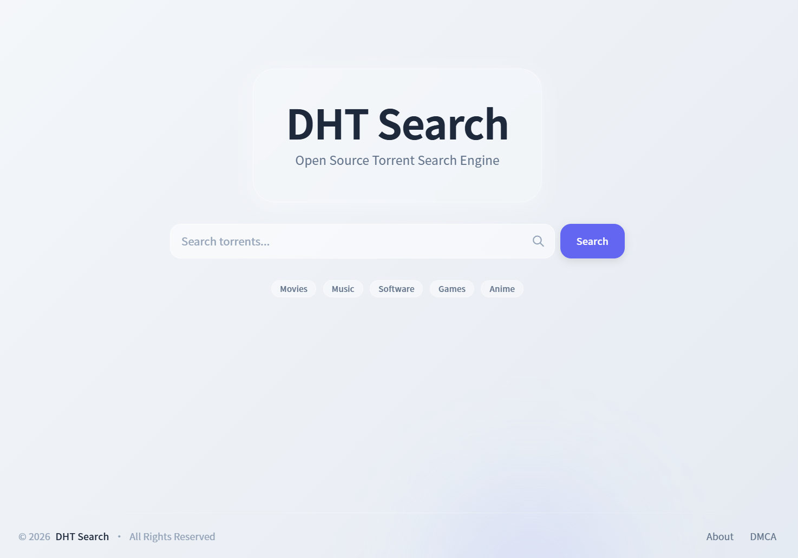

# DHT Search - Open Source Torrent Search Engine

[English](README.md) | [简体中文](README_CN.md)

A complete, high-performance distributed torrent search system with DHT crawler, RESTful API, and responsive web UI.



## Features

- **DHT Crawler** - Multi-process architecture for high-concurrency magnet link collection
- **REST API** - FastAPI-based endpoints for search, torrent details, and DMCA complaints
- **Web UI** - Modern Next.js interface with bilingual support (English/Chinese)
- **Full-Text Search** - MySQL 8 Ngram parser for Chinese/English without external libraries
- **High Performance** - Redis caching and MySQL 8 optimizations for large-scale data
- **Smart Sorting** - Sort by time, health score, popularity, size, or relevance
- **Auto Cleanup** - Automatically removes data older than 2 years
- **DMCA Compliance** - Complete copyright complaint handling system
- **Process Guardian** - PM2-based 7x24 hour stable operation

## Tech Stack

### Backend

| Technology | Purpose |
|------------|---------|
| Python 3.10+ | Development language |
| FastAPI | Web framework |
| aiohttp | Async HTTP client |
| MySQL 8.0 | Primary database |
| Redis 6.0+ | Caching and rate limiting |

### Frontend

| Technology | Purpose |
|------------|---------|
| Next.js 14 | React framework |
| React 18 | UI library |
| TypeScript 5 | Type safety |
| Tailwind CSS 3 | Styling framework |
| i18next | Internationalization |

## Screenshots

See [`screenshot/`](screenshot/) directory for more screenshots:

- `index.png` - Home page with search entry and hot tags
- `search.png` - Search results with multi-dimensional sorting and filtering
- `info.png` - Torrent detail page with file list and related information

## Quick Start

### Requirements

- Python 3.10+
- Node.js 18+
- MySQL 8.0+
- Redis 6.0+

### 1. Database Initialization

```bash
mysql -u root -p -e "CREATE DATABASE dht_crawler CHARACTER SET utf8mb4;"
mysql -u root -p dht_crawler < database/schema.sql
mysql -u root -p dht_crawler < database/admin_schema.sql
```

Configure MySQL full-text search (`my.cnf` or `my.ini`):

```ini
[mysqld]
ngram_token_size=2
```

### 2. Backend Installation

```bash
pip install -r requirements_db.txt
pip install -r requirements_api.txt
```

### 3. Frontend Installation

```bash
cd frontend
npm install
```

### 4. Start Services

**Development Mode:**

```bash
# Terminal 1 - DHT Crawler
python main.py

# Terminal 2 - API Server
cd api
uvicorn main:app --host 0.0.0.0 --port 8000 --reload

# Terminal 3 - Frontend
npm run dev
```

**Production Mode (PM2):**

```bash
pm2 start ecosystem.config.js
pm2 save
pm2 startup
```

## Project Structure

```
dht_dk/
├── api/                # FastAPI backend
├── config/             # System configuration
├── database/           # Database scripts and clients
├── screenshot/         # Project screenshots
├── frontend/           # Next.js frontend
├── services/           # Core business logic
├── workers/            # Background tasks
├── main.py             # DHT crawler entry point
├── ecosystem.config.js # PM2 configuration
└── README_CN.md        # Chinese introduction
```

## Configuration

### Environment Variables

Copy `.env.example` to `.env` and modify:

```bash
cp .env.example .env
```

Main configuration items:

```bash
# Database
DHT_MYSQL_HOST=localhost
DHT_MYSQL_PASSWORD=your_password

# Redis
DHT_REDIS_HOST=localhost

# API Security
DHT_API_KEY_AUTH=False
```

### Frontend Configuration

Modify `frontend/config/site.ts`:

```typescript
export const siteConfig = {
    name: 'DHT Search',
    url: 'https://your-domain.com',
    contact: {
        email: 'admin@your-domain.com',
        github: 'https://github.com/yourusername/dht-search',
    },
}
```

## Security Features

- **Keyword Filtering** - Automatic filtering of illegal content
- **DMCA Complaint Handling** - Complete copyright complaint workflow
- **API Rate Limiting** - Redis-based access control
- **Referer Protection** - Configurable whitelist mechanism

## Maintenance & Monitoring

### Log Location

```
logs/
├── crawler-error.log
├── crawler-out.log
├── api-error.log
├── api-out.log
├── frontend-error.log
└── frontend-out.log
```

### Data Cleanup

Automatically clean data older than 2 years:

```bash
python cleanup_old_data.py --dry-run  # Dry run
python cleanup_old_data.py            # Actual cleanup
```

### Health Check

```bash
python health_check.py                # Single check
python health_check.py --loop         # Continuous monitoring
```

## License

MIT License
